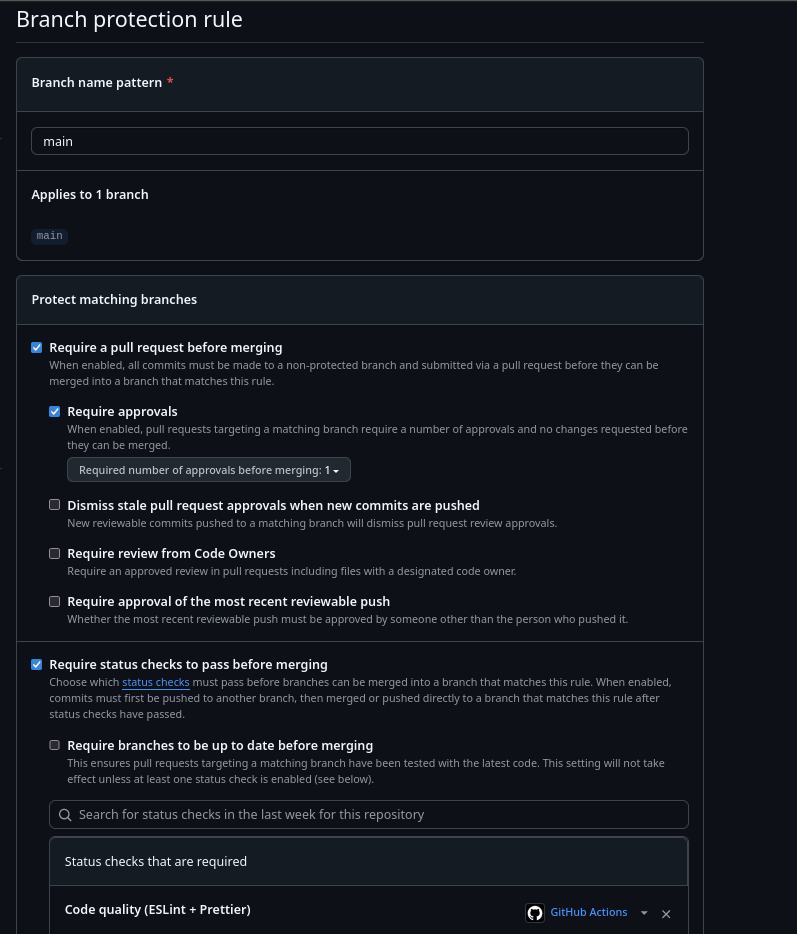

# Support API


API Node.js/Express connectée à MongoDB permettant de gérer les types de requêtes du support client.  
Le projet inclut une intégration continue (CI) via GitHub Actions, avec vérifications automatiques du code (ESLint/Prettier) et tests (Jest + Supertest).

---

## Installation et exécution locale

### 1. Cloner le dépôt

```bash
git clone https://github.com/AlexTng44000/tp_git_30-10-2025.git
cd support-api
```
## Installer les dépendances 
```
npm install
```

## Créer un fichier .env 
```
MONGODB_URI=mongodb://127.0.0.1:27017/support_api
PORT=3000
```

## Lancer l'application
```
npm run dev
```
> L'API tourne sur le port 3000 `http://localhost:3000`

## Structure du projet :
support-api/  
│  
├── src/  
│   ├── config/  
│   │   └── database.js        # Connexion MongoDB  
│   ├── models/  
│   │   └── RequestType.js     # Modèle principal  
│   ├── routes/  
│   │   └── requestTypes.js    # Routes de l’API  
│   └── server.js              # Point d’entrée  
│  
├── scripts/  
│   └── seed.js                # Script d’insertion des données  
│  
├── tests/  
│   └── requestTypes.test.js   # Tests Jest + Supertest  
│  
├── .github/  
│   └── workflows/  
│       └── ci.yml             # Pipeline GitHub Actions  
│  
├── .eslintrc.js  
├── .prettierrc  
├── package.json  
├── .gitignore  
└── README.md  

## Tests
```
npm test
```
## Integration CI/CD
1. Workflow github actions  
le fichier `.github/workflows/ci.yml` éxecute 2 jobs :   
    1. code-quality => vérifie la cohérence du code via :  
        > `npm run lint`  
        > `npm run format:check`  
    2. tests => Execute Jest sur un service MongoDB  
        > `npm test`  
        > Genere un rapport de couverture `coverage/`   

2. Workflow git (Branches et PR)  
    1. Création de la branche 
    ```
    git checkout -b feature/<nom-de-fonctionnalite>
    ```
    2. Commits convention  
        > init: initialisation du projet  
        > feat: ajout d'une fonctionnalité  
        > test: test de la pipeline CI/CD  
        > fix: correction du code  
    3. Pull request (PR)  
        > Créer une PR sur Github  
        > Remplir le template `.github/pull_request_template.md`  
        > Vérifier que les test CI passent  
        > Fusionner uniquement après validation  
        > Supprimer la branche après le merge  
    4. Protection de la branche main   
        > Interdiction du push direct  
        > Obligation de passer par une PR  
        > Checks obligatoires : `code-quality` & `tests`  

3. Endpoints disponnibles :
    GET => /health => Vérifie l'état de l'API  
    GET => /api-request-types => Liste les types actifs  
    GET => /api/request-types/:id => détail d'un type  
    POST => /api/request-types => Créer un nouveau type

4. Données dans seed :  
    Insère dans seed.js 5 types de requêtes standard:
        > `node scripts/seed.js`  

## 🛡️ Branch Protection

The `main` branch is protected to enforce code quality and workflow consistency.  
Pull requests must pass all checks before merging.




# END
Project successfully configured with ESLint, Prettier, Jest, and GitHub Actions.